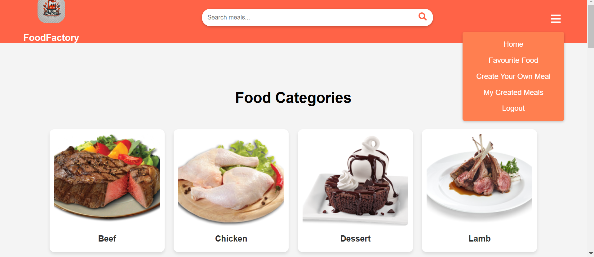
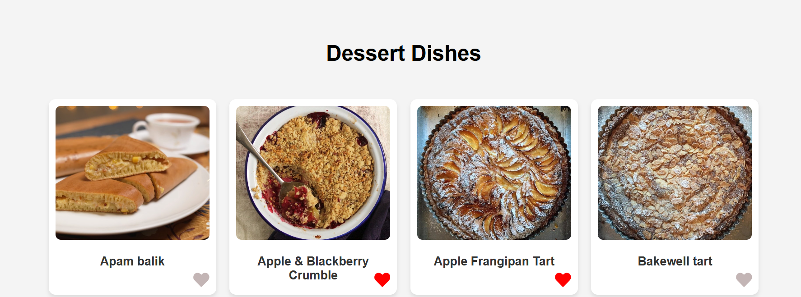
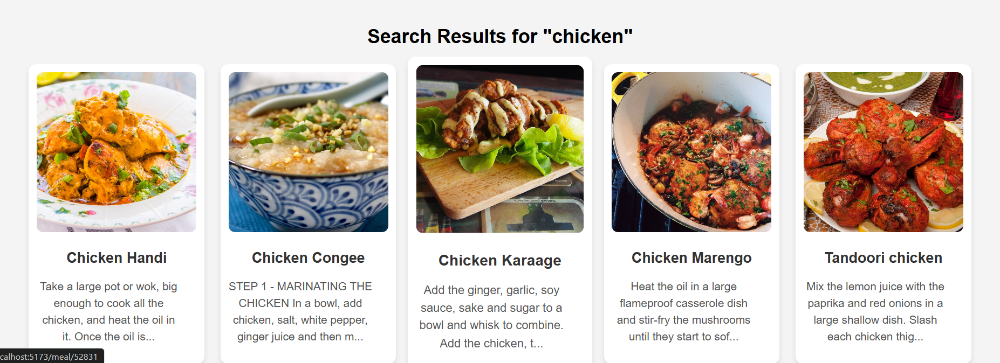

FOOD FACTORY 

This project is designed to showcase a wide variety of foods, organized into different categories. Within each category, users can explore numerous meals, each accompanied by detailed information, including ingredients and preparation methods.

Additionally, users can add any meal to their favorites, which can be accessed later on the favorites page. Another key feature allows users to create their own meals by specifying a title, category, preparation method, and uploading an image. These custom meals will be displayed on the "Created Meals" page.

Moreover, the app includes a search bar, enabling users to quickly find any meal they are looking for.... 

- [To visit](https://testproject-git-master-fadysaadeddins-projects.vercel.app ) 

